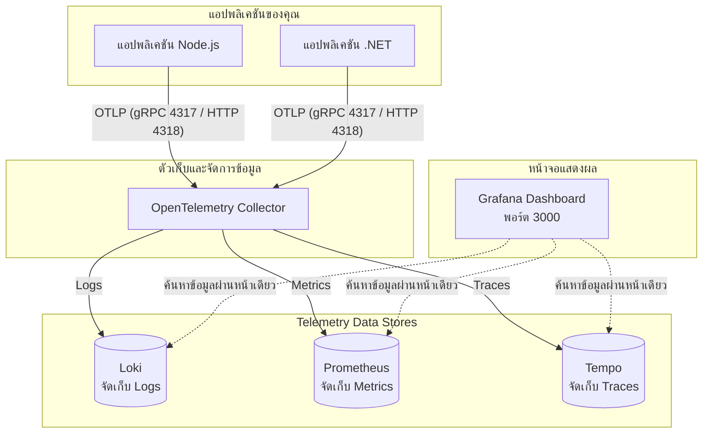

# คู่มือการเชื่อมต่อระบบวิเคราะห์ข้อมูลการทำงาน (Observability Integration Guide)

เอกสารชุดนี้จัดทำขึ้นเพื่อใช้สำหรับเป็นแนวทางให้กับทีมพัฒนาในการนำแอปพลิเคชัน (Node.js, .NET, หรือเทคโนโลยีอื่นๆ) มาเชื่อมต่อเข้ากับ **Core Telemetry Stack (Observability Stack)** เพื่อเก็บข้อมูล **Traces (เส้นทางการทำงาน), Metrics (สถิติการใช้งานระบบ) และ Logs**

---

## 📐 สถาปัตยกรรมระบบ (Architecture)

แอปพลิเคชันของคุณจะส่งข้อมูล Telemetry ออกมาผ่านทางโปรโตคอล **OTLP (OpenTelemetry Protocol)** ไปยัง **OTel Collector** ที่เป็นตัวกลางคัดแยกและนำข้อมูลไปจัดเก็บไว้ในฐานข้อมูลแต่ละประเภทเพื่อเปิดให้ค้นหาผ่าน **Grafana**

### แผนผังการทำงาน (Text-based Flow)
```text
           [ แอปพลิเคชันปลายทาง (.NET / Node.js / Go) ]
                                |
                                | OTLP (gRPC: 4317 / HTTP: 4318)
                                v
                   [ OpenTelemetry Collector ]
                                |
           +--------------------+--------------------+
           |                    |                    |
           v (Logs)             v (Metrics)          v (Traces)
     [ Grafana Loki ]     [ Prometheus ]      [ Grafana Tempo ]
           |                    |                    |
           +--------------------+--------------------+
                                |
                                v
                    [ Grafana Dashboard (3000) ]
```

### แผนผังในรูปแบบ Mermaid Diagram
*(จะแสดงผลเป็นภาพกราฟิกสวยงามเมื่อเปิดผ่านโปรแกรมที่รองรับ Markdown Preview เช่น VS Code ที่ลงส่วนขยาย Mermaid, GitHub, หรือ Notion)*



---

## 🔌 พอร์ตและ Endpoint ที่สำคัญ (Local Dev)

| บริการ | หน้าที่ | พอร์ต / URL | ข้อมูลการเข้าสู่ระบบ (เริ่มต้น) |
| :--- | :--- | :--- | :--- |
| **Grafana** | หน้าจอ Dashboard และสืบค้นข้อมูล | [http://localhost:3000](http://localhost:3000) | Username: `admin`<br>Password: `admin` |
| **OTLP gRPC** | Endpoint สำหรับส่งข้อมูลผ่าน gRPC | `localhost:4317` | - |
| **OTLP HTTP** | Endpoint สำหรับส่งข้อมูลผ่าน HTTP | `http://localhost:4318` | - |

---

## ⚙️ การตั้งค่า Environment Variables ในโปรเจกต์ของคุณ

แอปพลิเคชันของคุณจำเป็นต้องตั้งค่าตัวแปรสภาพแวดล้อมดังต่อไปนี้เพื่อเชื่อมต่อไปยัง Collector:

```bash
# ชื่อระบบ/แอปพลิเคชันของคุณ (จะนำไปฟิลเตอร์ใน Grafana)
OTEL_SERVICE_NAME=my-awesome-service

# ชี้ปลายทางการส่งข้อมูลไปยัง OTel Collector
OTEL_EXPORTER_OTLP_ENDPOINT=http://localhost:4318 # หากใช้ HTTP (พอร์ตเริ่มต้น)
# OTEL_EXPORTER_OTLP_ENDPOINT=http://localhost:4317 # หากใช้ gRPC

# เลือกโปรโตคอลการส่งข้อมูล (สำหรับ HTTP แนะนำ protobuf)
OTEL_EXPORTER_OTLP_PROTOCOL=http/protobuf # หรือ grpc

# ข้อมูลระบุตำแหน่งย่อยเพื่อแบ่งประเภท
OTEL_RESOURCE_ATTRIBUTES=deployment.environment=local,service.namespace=scc
```

---

## 💻 วิธีการติดตั้งและเขียนโค้ดเชื่อมต่อ (Code Integration)

### 🟢 สำหรับ Node.js (Express ESM)

> [!IMPORTANT]
> **ESM Import Order Caveat**: สำหรับระบบที่รันด้วย ESM (`"type": "module"`) จำเป็นต้องสั่ง `sdk.start()` ก่อนที่จะทำการโหลดโมดูล `express` เสมอ มิฉะนั้นโมดูลจะไม่โดนดักจับข้อมูล (Auto-Instrumentation จะไม่ทำงาน) แนะนำให้ใช้ **Dynamic Import** เพื่อตัดปัญหานี้

#### 1. ติดตั้ง Packages ที่จำเป็น
```bash
npm install @opentelemetry/api @opentelemetry/sdk-node @opentelemetry/auto-instrumentations-node @opentelemetry/exporter-trace-otlp-http express
```

#### 2. เขียนไฟล์เริ่มต้นระบบ (เช่น `index.js`)
```javascript
import { NodeSDK } from '@opentelemetry/sdk-node';
import { getNodeAutoInstrumentations } from '@opentelemetry/auto-instrumentations-node';
import { OTLPTraceExporter } from '@opentelemetry/exporter-trace-otlp-http';

// 1. ตั้งค่าและสตาร์ท OpenTelemetry SDK เป็นอันดับแรกสุด
const sdk = new NodeSDK({
  traceExporter: new OTLPTraceExporter(),
  instrumentations: [getNodeAutoInstrumentations()]
});
sdk.start();

// 2. ใช้ dynamic import เพื่อโหลด express หลังจาก OTel สตาร์ทแล้ว
const { default: express } = await import('express');
const app = express();

app.get('/health', (_req, res) => {
  res.json({ ok: true, service: process.env.OTEL_SERVICE_NAME || 'my-service' });
});

app.get('/profile/:id', async (req, res) => {
  await new Promise(resolve => setTimeout(resolve, 80)); // จำลองการดีเลย์
  res.json({ profile_id: req.params.id, status: 'Active' });
});

app.listen(8080, () => {
  console.log('Server is running on http://localhost:8080');
});
```

---

### 🔵 สำหรับ .NET (ASP.NET Core)

#### 1. ติดตั้ง NuGet Packages
```bash
dotnet add package OpenTelemetry.Extensions.Hosting
dotnet add package OpenTelemetry.Instrumentation.AspNetCore
dotnet add package OpenTelemetry.Instrumentation.Http
dotnet add package OpenTelemetry.Exporter.OpenTelemetryProtocol
```

#### 2. ตั้งค่าใน `Program.cs`
```csharp
using OpenTelemetry.Resources;
using OpenTelemetry.Trace;
using OpenTelemetry.Metrics;

var builder = WebApplication.CreateBuilder(args);

// อ่านการตั้งค่าจาก appsettings.json
var serviceName = builder.Configuration["OpenTelemetry:ServiceName"] ?? "dotnet-api";
var otlpEndpoint = builder.Configuration["OpenTelemetry:OtlpEndpoint"] ?? "http://localhost:4317"; // ใช้ gRPC พอร์ต 4317

builder.Services.AddOpenTelemetry()
    .ConfigureResource(resource => resource
        .AddService(serviceName)
        .AddAttributes(new Dictionary<string, object>
        {
            ["deployment.environment"] = "local",
            ["service.namespace"] = "scc"
        }))
    .WithTracing(tracing => tracing
        .AddAspNetCoreInstrumentation() // ดักจับ HTTP inbound
        .AddHttpClientInstrumentation() // ดักจับ HTTP outbound
        .AddOtlpExporter(options => options.Endpoint = new Uri(otlpEndpoint)))
    .WithMetrics(metrics => metrics
        .AddAspNetCoreInstrumentation()
        .AddHttpClientInstrumentation()
        .AddOtlpExporter(options => options.Endpoint = new Uri(otlpEndpoint)));

var app = builder.Build();

app.MapGet("/health", () => Results.Ok(new { ok = true, service = serviceName }));

app.Run();
```

---

## 🐳 การเชื่อมต่อระหว่าง Docker Container (ในเครื่องเดียวกัน)

หากแอปพลิเคชันของคุณรันอยู่ภายในตู้คอนเทนเนอร์ Docker บนเครื่องคอมพิวเตอร์ตัวเดียวกันกับ Observability Stack คุณจำเป็นต้องนำคอนเทนเนอร์เหล่านั้นเข้ามาร่วมเน็ตเวิร์กเดียวกัน เพื่อให้อ้างอิงชื่อบริการ `core-otel-collector` แทนการใช้ `localhost`

แก้ไขไฟล์ `docker-compose.yml` ของโปรเจกต์คุณโดยเพิ่มเติมส่วนต่อไปนี้:

```yaml
services:
  my-web-api:
    image: node:20
    environment:
      # ชี้ endpoint ไปที่ชื่อ Container ของ Collector แทน localhost
      - OTEL_EXPORTER_OTLP_ENDPOINT=http://core-otel-collector:4318
      - OTEL_EXPORTER_OTLP_PROTOCOL=http/protobuf
      - OTEL_SERVICE_NAME=my-web-api
    networks:
      - telemetry_network

networks:
  telemetry_network:
    name: observability-stack_default # ลิงก์เข้าหาเน็ตเวิร์กหลักของ Observability
    external: true
```

---

## 🕵️‍♂️ การตรวจสอบข้อมูลใน Grafana (Explore)

หลังรันแอปพลิเคชันและมีการทดสอบกดเรียกใช้งาน API ให้เข้าไปตรวจสอบที่ **Grafana Explore** ดังนี้:

### 1. การดูข้อมูล Traces (เส้นทางประมวลผล) ใน Tempo
1. เข้า [http://localhost:3000](http://localhost:3000) -> ไปที่เมนู **Explore**
2. เลือก Data Source ด้านบนซ้ายเป็น **Tempo**
3. เลือกแถบประเภทคิวรี่เป็น **TraceQL**
4. กรอกคำค้นหาเพื่อกรองเฉพาะบริการของคุณ (ค่าสตริงต้องครอบด้วยอัญประกาศคู่ `""` เสมอหากมีเครื่องหมาย `-`):
   ```text
   {resource.service.name="my-awesome-service"}
   ```
5. กด **Run query** คุณจะเห็นรายการ Request ทั้งหมดที่แอปพลิเคชันตอบสนอง สามารถกดคลิกดูรายละเอียดของช่วงเวลาในแต่ละ Function / Span เพื่อใช้วิเคราะห์คอขวด (Performance Bottleneck) ได้ทันที

---
