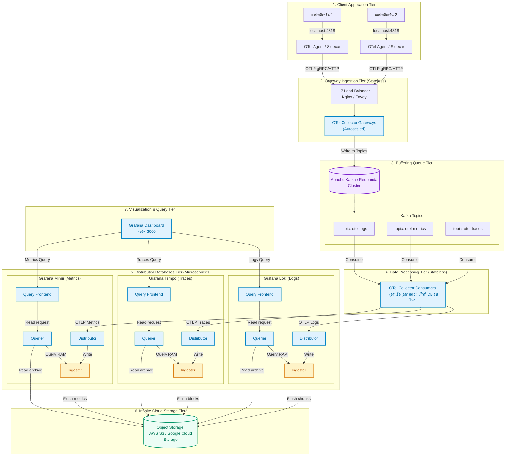

# แผนยุทธศาสตร์การขยายระบบ (Observability Stack Scale-out Strategy)

เอกสารฉบับนี้จัดทำขึ้นเพื่อแสดงแนวทาง แนวคิดเชิงสถาปัตยกรรม และขั้นตอนการปฏิบัติในการขยายขนาดระบบ (Scale-out) ของ **Core Telemetry Stack** เพื่อรองรับโหลดการใช้งานปริมาณสูงในระดับ Production (High Load / High Traffic)

---

## 📐 สถาปัตยกรรมชุดใหญ่ระดับองค์กร (Enterprise Distributed Architecture)

แผนผังด้านล่างนี้คือสถาปัตยกรรมแบบ **Full-scale** ที่เชื่อมต่อทั้ง 2 โซลูชันเข้าด้วยกัน ได้แก่ **การใช้ระบบคิวคั่นกลาง (Kafka Queue) ร่วมกับการแยกชิ้นส่วนของฐานข้อมูล (Loki/Tempo/Mimir Microservices)** บนระบบจัดเก็บไฟล์คลาวด์ (S3/GCS Object Storage)

---

## 🔍 อธิบายการไหลของข้อมูลในระบบชุดใหญ่ (Data Flow Step-by-Step)

ระบบชุดใหญ่นี้ถูกหั่นสถาปัตยกรรมออกเป็น **7 ชั้นตอนหลัก (7 Tiers)** เพื่อให้ระบบไม่มีคอขวดและทนทานสูงสุด:

### ชั้นที่ 1: Client Application Tier (ฝั่งแอปพลิเคชัน)
* แอปพลิเคชันยิงข้อมูล Telemetry ออกมาผ่านพอร์ต `localhost` ไปยัง **OTel Agent (Sidecar)** ที่ติดตั้งเคียงคู่กันในเครื่องโฮสต์เดียวกัน เพื่อความเร็วในการตอบสนองและลดภาระเน็ตเวิร์กของตัวแอป

### ชั้นที่ 2: Gateway Ingestion Tier (ตัวรับด่านหน้า - Stateless)
* OTel Agent จะรวบรวมข้อมูลส่งต่อผ่านเน็ตเวิร์กวงกว้างมาที่ **L7 Load Balancer** ซึ่งจะนำสัญญาณโยนกระจายเฉลี่ยงานเข้าหากลุ่ม **OTel Collector Gateways** (สเกลแนวนอนได้ไม่มีจำกัด) ทำหน้าที่รับข้อมูล ตรวจเช็ก Format และส่งเข้าคิว

### ชั้นที่ 3: Buffering Queue Tier (ระบบคิวรับแรงกระแทก)
* OTel Collector ด่านหน้า จะนำข้อมูลแยกส่งลงใน **Kafka Topics** แยกตามประเภทข้อมูล (`otel-logs`, `otel-metrics`, `otel-traces`)
* หากช่วงนี้ระบบฐานข้อมูลปลายทางช้า หรือมอนิเตอร์พัง ข้อมูลดิบทั้งหมดจะถูกต่อคิวเรียงกันอยู่ใน Kafka ป้องกันข้อมูลการทำงานของระบบตกหล่น 100%

### ชั้นที่ 4: Data Processing Tier (ตัวดึงข้อมูลไปเขียน - Stateless)
* กลุ่ม **OTel Collector Consumers** จะคอยดึง (Consume) ข้อมูลจาก Kafka เพื่อไปส่งต่อให้กับฐานข้อมูล
* หากฐานข้อมูลหลังบ้านทำงานไม่ทัน เราสามารถควบคุมปริมาณความเร็วในการดึงข้อมูล (Rate Limiting) ที่ชั้นนี้ได้เพื่อไม่ให้ฐานข้อมูลพัง

### ชั้นที่ 5: Distributed Databases Tier (ฐานข้อมูลแยกชิ้นส่วนย่อย)
* ข้อมูล Telemetry จะถูกยิงแยกเข้าหา **Distributors** ของฐานข้อมูลแต่ละตัว (Loki, Tempo, Mimir)
* **Distributors** จะกระจายข้อมูลไปเขียนไว้ในแรมของ **Ingesters** ซึ่งทำหน้าที่รวบรวมก้อนข้อมูลดิบ
* เมื่อ Grafana เรียกค้นหาข้อมูล คำสั่งจะถูกส่งมาที่ **Query Frontend** เพื่อหั่นแบ่งงานและส่งตัว **Queriers** ไปดึงข้อมูลล่าสุดจากแรมของ Ingester และข้อมูลเก่าในดิสก์คลาวด์มารวมร่างกันส่งกลับ

### ชั้นที่ 6: Infinite Cloud Storage Tier (ระบบเก็บไฟล์คลาวด์)
* **Ingesters** จะคอยกวาดข้อมูลในแรม (Flush) ออกไปบันทึกเป็นไฟล์ถาวรเก็บไว้ใน **AWS S3 หรือ GCS** ทุกๆ ช่วงเวลาที่กำหนด (เช่น ทุกๆ 1 ชั่วโมง) ทำให้หมดกังวลเรื่องเนื้อที่ดิสก์เซิร์ฟเวอร์เต็ม

### ชั้นที่ 7: Visualization & Query Tier (หน้าจอแสดงผล)
* ทีมพัฒนาเข้าใช้งานผ่านหน้าจอ **Grafana** โดยส่งคำสั่ง Query วิ่งตรงผ่านระบบ Private network เข้าไปดึงผลลัพธ์ผ่านตัวค้นหาของ Loki, Tempo และ Mimir เพื่อดึงภาพสถิติรวมขึ้นมาโชว์ในหน้าจอเดียว

---

---

## 1. การสเกลฝั่งรับข้อมูล (OpenTelemetry Collector)

**OTel Collector** ทำหน้าที่รับข้อมูลมาประมวลผลระยะสั้นและไม่มีการเก็บสถานะถาวร (Stateless) จึงเป็นจุดที่ **สเกลในแนวนอน (Horizontal Scale) ได้ง่ายที่สุด**

### ⚙️ วิธีการดำเนินการ:
* **การติดตั้ง**: เพิ่มจำนวนตู้คอนเทนเนอร์ (Replicas) ขึ้นเป็นหลายๆ ตัวตามปริมาณ CPU / Memory (เช่น สเกลตั้งแต่ 3 ถึง 10 ตัว)
* **การเชื่อมต่อ**: วาง **Load Balancer ระดับ Layer 7** (เช่น Envoy, Nginx, หรือ AWS ALB) ไว้หน้ากลุ่ม Collector
* **ข้อควรระวัง (gRPC Load Balancing)**: gRPC ใช้การเชื่อมต่อแบบยาว (Persistent TCP) ทำให้ L4 Load Balancer จะไม่กระจายงานออกไปยัง Collector ตัวใหม่ที่เพิ่งเกิด ดังนั้นจำเป็นต้องใช้ **L7 Load Balancer** ที่รู้จัก HTTP/2 เสมอ เพื่อกระจายงานในระดับราย Request

---

## 2. การเพิ่มระบบคิวรับแรงกระแทก (Message Queue)

เมื่อมีเหตุการณ์ทราฟฟิกพุ่งสูงฉับพลัน (Traffic Spike) เช่น ช่วงเวลาโปรโมชัน หรือแอปพลิเคชันเกิด Loop Error การส่งข้อมูลเข้าฐานข้อมูลตรงๆ อาจทำให้ฐานข้อมูลล่มได้

### ⚙️ วิธีการดำเนินการ:
* **ติดตั้งคิวคั่นกลาง**: แทรกระบบส่งข้อความประสิทธิภาพสูง เช่น **Apache Kafka** หรือ **Redpanda** คั่นกลางระหว่างหน้าบ้านกับหลังบ้าน
* **การไหลของข้อมูล**: แอปพลิเคชันยิงข้อมูลมายัง OTel Collector -> Collector นำไปหยอดลงในคิวของ Kafka -> ปลายทางมี Collector อีกกลุ่มทำหน้าที่เป็น Consumer ดึงข้อมูลจาก Kafka ไปเขียนลง Loki/Tempo อย่างสม่ำเสมอ
* **ข้อดี**:
  * **Zero Data Loss**: หาก Loki หรือ Tempo ปิดปรับปรุง ข้อมูลจะยังไม่หาย แต่จะถูกเก็บรออยู่ในคิวของ Kafka เมื่อฐานข้อมูลเปิดระบบกลับมา คอนซูเมอร์จะดึงข้อมูลไปเขียนต่อจนครบเอง
  * **Backpressure Control**: คอนซูเมอร์สามารถกำหนดขีดจำกัดความเร็วในการเขียนลง DB ไม่ให้เกินกำลังที่รับไหวได้

---

## 3. การแตกส่วน Loki & Tempo (Distributed Microservices)

ในปัจจุบันตัวทดสอบรันแบบ Single Binary (ทำทุกอย่างในเครื่องเดียว) หากข้อมูลรวมต่อวันเริ่มมีขนาดหลักหลายร้อย Gigabyte ถึง Terabyte แนะนำให้แตกชิ้นส่วนการทำงานภายในออกแยกจากกัน:

### ⚙️ ส่วนประกอบที่ต้องติดตั้งแยก Service:
1. **Distributor**: รับและแยกแยะข้อมูลก่อนส่ง (สเกลแนวนอนได้ง่าย)
2. **Ingester**: พักข้อมูลในแรมชั่วคราวและทำการเขียนไฟล์ (สเกลตามอัตรา Write โหลด)
3. **Querier & Query Frontend**: รับคำสั่งค้นหาจาก Grafana และกระจายประมวลผล (สเกลตามอัตราการเปิดดู Dashboard)
4. **Compactor**: ยุบรวมและจัดการเนื้อที่ไฟล์เก่าในระบบคลาวด์ (รันเพียงตัวเดียวเดี่ยวๆ)

### 💾 การเปลี่ยนระบบเก็บข้อมูล (Storage Backends):
ต้องเปลี่ยนพาธการบันทึกไฟล์โลคอลทั้งหมด ไปชี้ที่ **Object Storage บนคลาวด์ เช่น AWS S3 หรือ Google Cloud Storage (GCS)** ซึ่งมีความทนทานและพื้นที่เก็บข้อมูลไม่จำกัด

---

## 4. การสเกลฝั่งจัดเก็บสถิติ (Metrics / Prometheus)

Prometheus ถูกออกแบบมาให้ทำหน้าที่ดึงข้อมูลเก็บลงดิสก์ส่วนตัว (Stateful) จึงขยายตัวแนวนอนได้ยากที่สุด

### ⚙️ วิธีการดำเนินการเมื่อสเกลใหญ่ขึ้น:
* **เปลี่ยนไปใช้ Grafana Mimir หรือ Thanos**:
  * นำ Prometheus ไปทำหน้าที่เป็นตัวกวาดสถิติระดับเครื่องเปล่าๆ (Prometheus Agent)
  * ใช้คำสั่ง **`remote_write`** ส่งข้อมูล Metrics ทั้งหมดออกไปจัดเก็บที่ส่วนกลางคือ **Grafana Mimir** ซึ่งรองรับการทำงานแบบ Microservices และจัดเก็บไฟล์ลง S3 เหมือนกับ Loki และ Tempo

---

## 📈 ตารางประเมินระยะการปรับปรุงระบบ (Scaling Roadmap)

| ปริมาณข้อมูลต่อวัน | ระดับความซับซ้อน | สิ่งที่ควรทำเรียงตามลำดับความสำคัญ |
| :--- | :--- | :--- |
| **น้อยกว่า 50 GB / วัน** | **น้อย** | รันแบบ Single Binary ตามโครงสร้างปัจจุบัน + เก็บไฟล์ลงดิสก์ธรรมดา |
| **50 - 500 GB / วัน** | **ปานกลาง** | 1. ย้ายการเก็บไฟล์ Loki/Tempo ไปลง **AWS S3 / GCS** เพื่อป้องกันดิสก์เต็ม 2. วาง **Load Balancer** และสเกลเฉพาะตัว **OTel Collector** เพิ่มขึ้น |
| **500 GB - 2 TB / วัน** | **สูง** | 1. นำ **Kafka / Redpanda** เข้ามาคั่นกลางเพื่อความปลอดภัยป้องกันการสูญหายของข้อมูล 2. แตกส่วน **Loki และ Tempo ให้ทำงานเป็น Microservices** แยกเครื่องรับ/ส่ง |
| **มากกว่า 2 TB / วัน** | **สูงมาก** | ย้ายระบบจัดเก็บ Metrics จาก Prometheus ไปใช้งาน **Grafana Mimir** เต็มรูปแบบ |
